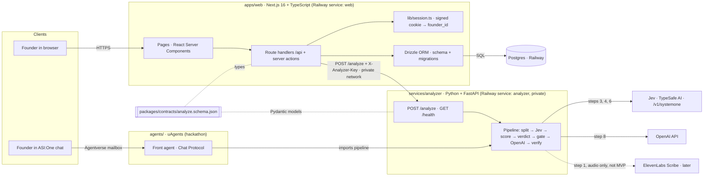
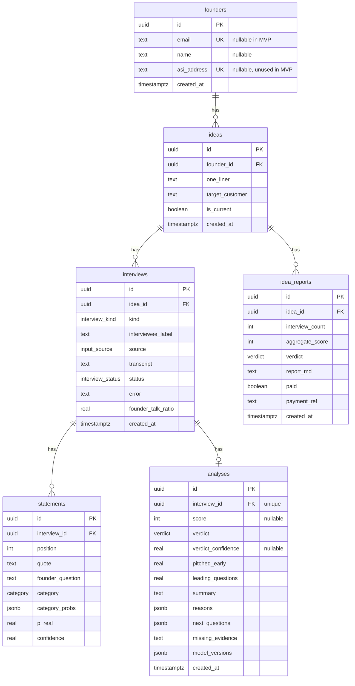

# validate.ai: Engineering Spec (SPEC)

> **Status:** v1 · 2026-10-03 · **settled decisions**. Change them only if one turns out to be impossible, and record the change in §0.
> **Companion:** [`PRD.md`](PRD.md) is the intent (what and why). This file is the how.
> **Audience:** engineers and coding agents (including the dark factory) building this repo.
> **Core rule, everywhere:** **Jev judges, OpenAI writes, Python counts.**

---

## 0. Changes from the original brief, and why

These points differ from the team brief of 2026-10-03. Each was checked against current vendor docs on 2026-10-03.

| # | Brief said | Spec says | Why |
| --- | --- | --- | --- |
| 0.1 | Model `jev-latest` | **Pin `jev-1.13.0`**, set in `rubric.json` | `jev-latest` is a moving alias. Thresholds (gate 0.6, score bands) are calibrated against one version, so changing the version is a rubric change. |
| 0.2 | "Same transcript twice → same verdict" | Verdict = **mean of 3 Jev verdict calls**. The invariant becomes: same verdict on 3 runs, scores at most 5 points apart. | Jev has no seed or temperature. Its own docs say it is self-consistent, not deterministic, and its top `choice` label can flip on borderline cases. Averaging 3 calls costs about US$0.0001 per interview. |
| 0.3 | `statements[].confidence` | The **`category` choice's confidence** | A Jev `noul` returns only a probability, with no confidence field. |
| 0.4 | Web service root directory `apps/web` | Build `web` from the **repo root** with `pnpm --filter web` | `apps/web` imports `packages/contracts`, and the lockfile is at the root. A root directory of `apps/web` uploads neither, so the build fails. |
| 0.5 | No login (TBD) | **Anonymous signed-cookie session.** One founder per browser. | Rule 6 (isolation) needs an identity, and the demo needs zero friction. |
| 0.6 | `POST /api/interviews` "saves, calls analyzer, saves result" | It saves, returns **202** at once, runs the analysis with `after()`, and the page polls | The PRD journey shows a "processing" state. A 120 s blocking request would also be fragile. |
| 0.7 | Score formula | Adds: **`R + P == 0` → `null`**, and **round half up** | Prevents division by zero. Python's `round()` uses banker's rounding. |
| 0.8 | (none) | **Top quotes and founder mistakes are computed by code from Jev output**, not written by OpenAI | Keeps them verbatim and deterministic, and keeps the contract unchanged. |
| 0.9 | (none) | Transcript cap: **80,000 characters** | Jev accepts at most 32k tokens for state plus the longest question. 80k characters is about 20k tokens, which leaves room. |
| 0.10 | `/api/health` → `{status, db}` | `{status, db, analyzer}` | Interview R2.3b: "running" must prove all 3 services, not just that `web` booted. |
| 0.11 | Work arrives as GitHub issues | Work arrives as **cards on the validate.ai build board** (a Claude artifact). GitHub holds code and PRs only. | Team decision, 2026-10-04. |

---

## 1. Architecture

**A monorepo and a modular monolith: two services and one database.**

- **`apps/web`** is a Next.js app in TypeScript. It serves the pages **and** is the backend (route handlers and server actions). It is the **only** thing that talks to Postgres.
- **`services/analyzer`** is a stateless Python service (FastAPI). It runs the whole analysis: splitting, Jev, scoring, the gate and the OpenAI write-up (transcription later). It takes JSON, returns JSON, and never touches the database.
- There is **no separate TypeScript backend.**
- **`agents/`** holds the Fetch.ai uAgent that lets founders use the same pipeline from ASI:One. It is for the hackathon.



## 2. Stack

| Layer | Choice | Version policy |
| --- | --- | --- |
| Monorepo | pnpm workspaces (TS) + uv (Python). No Turborepo. | pnpm and uv latest stable |
| Web, frontend and backend | Next.js App Router, TypeScript, React Server Components, route handlers, server actions, `after()` from `next/server` | Next.js **16.x** (16.3.8 latest stable on 2026-10-03) |
| UI | Tailwind CSS + shadcn/ui. Brand: navy `#1C2A4D`, amber `#F5A623`, font Outfit. | latest stable |
| ORM and migrations | Drizzle ORM + drizzle-kit | **0.45.x / 0.31.x line. Not v1** (v1 is prerelease and changes the migrations layout). |
| Database | Postgres (Railway). Local: Docker Compose. | Postgres 16+ |
| Analyzer | Python 3.11+, FastAPI, Pydantic v2, httpx, asyncio, uvicorn | latest stable |
| Sentence splitting | `pysbd` (rule-based, deterministic) | latest stable |
| Judgment | Jev via `typesafe-sdk` (`from typesafe_sdk import AsyncTypeSafeClient, Choice, Noul`), model **`jev-1.13.0`** | `typesafe-sdk` ≥ 0.7.2 |
| Writing | OpenAI API (official `openai` Python SDK), structured outputs | Model: `OPENAI_MODEL` env, **TBD** |
| Transcription | ElevenLabs Scribe with speaker labels. **Not in the MVP.** | — |
| Hackathon agent | `uagents` 0.26.x, `mailbox=True`, Chat Protocol from `uagents_core.contrib.protocols.chat` | uagents 0.26.0 |
| Deploy | Railway: `web`, `analyzer`, `postgres` | — |
| Tests | Vitest (web), pytest (analyzer), Playwright (E2E) | latest stable |

## 3. Repo layout

The repo root is this repository (`realsignal/`).

```
apps/
  web/                              # Next.js + TypeScript
    app/
      (pages)/                      # /, /ideas, /ideas/[id], /interviews/[id], /upload
      api/
        ideas/route.ts              # POST, GET
        interviews/route.ts         # POST (save + schedule analysis)
        interviews/[id]/route.ts    # GET (status + result)
        health/route.ts             # GET (web + db)
    lib/
      session.ts                    # signed cookie <-> founder_id (the ONLY identity source)
      db/schema.ts                  # Drizzle schema (source of truth)
      db/queries.ts                 # every query takes founderId; nothing else queries the DB
      db/migrations/
      analyzer-client.ts            # the ONLY code that calls the analyzer
      contracts.ts                  # TS types generated from packages/contracts
    tests/
    railway.json
services/
  analyzer/                         # Python + FastAPI, stateless
    app/
      main.py                       # POST /analyze, GET /health
      models.py                     # Pydantic, checked against packages/contracts by a test
      rubric.json                   # categories, weights, Jev question texts, thresholds, model ids
      pipeline/
        split.py                    # speakers + sentences + talk ratio (no AI)
        jev.py                      # all Jev calls
        scoring.py                  # score formula (no AI)
        gate.py                     # confidence gate + missing_evidence text (no AI)
        writer.py                   # OpenAI write-up
        verify.py                   # verbatim quote check
        analyze.py                  # orchestrates the steps
        transcribe.py               # ElevenLabs (later, audio only)
    fixtures/                       # reference interviews + expected labels (protected)
    tests/
      recordings/                   # recorded Jev/OpenAI responses for unit tests
    pyproject.toml
    railway.json
agents/                             # Fetch.ai uAgent (hackathon)
  front_agent.py
  chat_proto.py
  pyproject.toml                    # depends on services/analyzer via a uv path dependency
packages/
  contracts/
    analyze.schema.json             # the JSON both sides agree on
docs/
  PRD.md
  SPEC.md
docker-compose.yml                  # local Postgres
package.json                        # root scripts, incl. `pnpm validate`
pnpm-workspace.yaml
.env.example
README.md
```

## 4. Ownership rules

1. **Only `apps/web` reads or writes Postgres**, and only through `lib/db/queries.ts`. The analyzer returns JSON; the web app saves it.
2. **Only `apps/web/lib/analyzer-client.ts` calls the analyzer.** Every call sends `X-Analyzer-Key`. The analyzer rejects a missing or wrong key with 401, using a constant-time comparison.
3. **`packages/contracts/analyze.schema.json` is the single source of truth** for the analyzer request and response. The TS types are generated from it. A pytest checks that the Pydantic models' JSON Schema matches it, and a Vitest checks that the generated types are current.
4. **Jev judges, OpenAI writes, Python counts.** OpenAI never sets or changes a label, a probability, the score or the verdict. Its output schema has no fields for them.
5. **Every quote shown to a founder appears word for word in the transcript.** Statement quotes are verbatim by construction (§5 step 2). Quotes inside OpenAI text are checked in step 9.
6. **A founder only ever sees their own ideas and interviews.** `founder_id` comes **only** from the session cookie, never from a request body, query string or path. Every query filters by it. Another founder's resource returns **404** (not 403, so its existence doesn't leak).
7. **No transcript text in logs.** Log ids, timings, model ids, rubric version and error codes only.
8. **The rubric is data.** Weights, question texts, thresholds and model ids live in `rubric.json`, not in code. Changing it is a reviewed change.

## 5. The analysis pipeline (`services/analyzer`)

```mermaid
sequenceDiagram
  autonumber
  actor F as Founder
  participant W as apps/web
  participant DB as Postgres
  participant A as analyzer
  participant J as Jev
  participant O as OpenAI
  F->>W: Submit transcript for idea X
  W->>DB: insert interview (status = processing)
  W-->>F: 202 {id, status: processing}
  Note over W: after() continues in the background
  W->>A: POST /analyze {idea, transcript, kind, interviewee_label}
  A->>A: split speakers + sentences, talk ratio
  par every customer sentence (max 8 concurrent)
    A->>J: {category: choice, is_real_signal: noul}
  end
  A->>J: {pitched_early: noul, leading_questions: noul} over founder turns
  A->>A: score; pre-gate counts
  A->>J: verdict (choice) × 3, probabilities averaged
  A->>A: confidence gate
  A->>O: write read-out from structured Jev output only
  A->>A: verify quotes are verbatim
  A-->>W: AnalyzeResult
  W->>DB: insert statements + analysis; status = done
  F->>W: page polls GET /api/interviews/:id → read-out
```

### Steps

1. **Transcribe.** *Not in the MVP.* Audio only, with ElevenLabs Scribe.
2. **Split** (Python, no AI). `split.py`:
   - **Turns:** a line starting with `Founder:` or `Customer:` (case-insensitive, optional leading whitespace) starts a turn. Lines with no label continue the previous turn. If the transcript has no labels at all → **422 `unlabelled_transcript`**.
   - **Sentences:** each turn is split with `pysbd`. Each sentence keeps its exact substring of the original transcript, so `transcript.find(quote) != -1` always holds.
   - **`position`:** 1-based index over **all** sentences, founder and customer, in transcript order.
   - **`founder_question`:** the full text of the founder turn just before the customer turn, or `null` if there isn't one.
   - **Talk ratio:** `founder_talk_ratio = founder_words / (founder_words + customer_words)`, where words are whitespace-separated tokens. It is computed over **founder** words, not customer words.
   - **Limits:** a transcript over **80,000 characters** → **422 `transcript_too_long`**.
3. **Judge every customer sentence** (Jev). One call per sentence, **max 8 concurrent**. Each call asks two questions about one state:
   - **state:** the idea, the founder question and the sentence, clearly labelled.
   - **questions:** `category` (`Choice`, the 5 categories) and `is_real_signal` (`Noul`).
   - **stored:**
     - `category` = Jev's chosen label
     - `category_probs` = Jev's `probabilities`
     - `confidence` = the choice's `confidence`
     - `p_real` = the noul value
4. **Judge the founder** (Jev). One call, with all founder turns in order as the state, numbered. It asks `pitched_early` (`Noul`) and `leading_questions` (`Noul`).
5. **Score** (Python, no AI). See the formula below.
6. **Verdict** (Jev). It runs only if the pre-gate counts pass (see the gate below).
   - **3 identical calls.** Each call has one `Choice` question over `keep_going`, `narrow_down`, `new_angle`, `pivot`. The state holds the idea, every non-neutral statement as `[#position] (category, p_real) "quote"`, and the score.
   - **Combine:**
     - average the 3 probability vectors
     - `verdict` = the argmax, with ties broken by rubric option order
     - `verdict_confidence` = the mean of the 3 `confidence` values
7. **Confidence gate** (Python). See below. If it trips, the verdict becomes `need_more_evidence`, and `missing_evidence` is a deterministic sentence listing each failed condition, e.g. `"Only 2 statements carried a signal (need 4). Only 96 customer words (need 150)."`
8. **Write** (OpenAI, structured outputs). The input is **only** the structured result of steps 2–7.
   - **Output schema:** `{summary: string, reasons: string[], next_questions: string[3]}`.
   - **Rules for the writer:** refer to statements as `[#position]`; never restate a verdict or score other than the ones given; if the gate tripped, explain what evidence is missing.
9. **Verify** (Python). The writer may quote with straight or curly double quotes. Every quoted span of **3 or more words** must be a verbatim substring of the transcript. The only normalisation allowed is collapsing whitespace and unifying the quote characters.
   - **Failure in a `reasons` item** → drop that item.
   - **Failure in `summary` or `next_questions`** → retry the writer **once**. A second failure means the analysis fails with `writer_unverifiable`.
   - **Paraphrases must fail this check.**

**Errors:**
- **Any Jev or OpenAI failure** (after the SDK's default retries: 2, with 429 included) fails the analysis with an error code.
- **There is never a default or fallback verdict.**
- **Per-call timeout:** 10 s for Jev, 60 s for OpenAI.
- **Analyzer budget:** 120 s overall.

### Categories (one set, used everywhere)

| Category | Group | Weight | Example |
| --- | --- | --- | --- |
| `commitment` | real | 3 | "Send me the pilot link, I'll try it Monday." |
| `past_pain` | real | 2 | "I pay someone $300 a month to do this by hand." |
| `hypothetical` | polite | 1 | "I'd probably use something like that." |
| `compliment` | polite | 1 | "Sounds like a cool app." |
| `neutral` | not counted | 0 | "We have about 12 tables." |

### Verdicts

`keep_going`, `narrow_down`, `new_angle`, `pivot` are chosen by Jev. `need_more_evidence` is set **only by the gate**.

### Jev questions (texts live in `rubric.json`)

| Key | Type | Question | Options |
| --- | --- | --- | --- |
| `category` | choice | What kind of statement is this from a potential customer? | commitment, past_pain, hypothetical, compliment, neutral |
| `is_real_signal` | noul | Does this statement show real pain or real buying intent, rather than politeness? | P(yes) 0–1 |
| `pitched_early` | noul | Did the founder describe the product before asking about the problem? | P(yes) 0–1 |
| `leading_questions` | noul | Did the founder ask questions that suggest the answer they want? | P(yes) 0–1 |
| `verdict` | choice | Given this evidence, what should the founder do next? | keep_going, narrow_down, new_angle, pivot |

### Score (0–100)

For each **non-neutral** customer sentence, `w` = its category weight and `p` = its `p_real`:

```
R = Σ w·p        over sentences whose category group is "real"
P = Σ w·(1 − p)  over sentences whose category group is "polite"
score = floor(100·R/(R+P) + 0.5)      # round half up
score = null  if there are no non-neutral sentences, or R + P == 0
```

`neutral` sentences count toward **neither** R nor P.

### Confidence gate

The verdict becomes `need_more_evidence` if **any** of these is true:

| Condition | Threshold (`rubric.json`) | Checked |
| --- | --- | --- |
| Non-neutral customer sentences | < 4 | before the verdict calls (if this trips, the calls are skipped and `verdict_confidence = null`) |
| Customer words | < 150 | before the verdict calls |
| Mean verdict confidence | < 0.6 | after the verdict calls |

A transcript where only the founder speaks always ends as `need_more_evidence`. It is never a guessed verdict.

### Founder mistakes and top quotes (computed by code, shown by the web app)

- **Top real quotes:** up to 3 statements in the `real` group, sorted by `p_real` descending.
- **Top polite quotes:** up to 3 statements in the `polite` group, sorted by `p_real` ascending.
- **Founder mistakes:** shown when a value is at or above its threshold.
  - Thresholds live in `rubric.json` under `founder_flags` (talk ratio, pitched_early, leading_questions).
  - **The values are TBD; 0.5 is proposed for all three.** Because the web app does not read `rubric.json`, the analyzer echoes the thresholds in `model_versions.founder_flags`.

### `rubric.json` shape (version "1")

```json
{
  "version": "1",
  "models": { "jev": "jev-1.13.0" },
  "concurrency": 8,
  "verdict_samples": 3,
  "categories": {
    "commitment":   { "group": "real",   "weight": 3 },
    "past_pain":    { "group": "real",   "weight": 2 },
    "hypothetical": { "group": "polite", "weight": 1 },
    "compliment":   { "group": "polite", "weight": 1 },
    "neutral":      { "group": "none",   "weight": 0 }
  },
  "questions": { "category": "…", "is_real_signal": "…", "pitched_early": "…", "leading_questions": "…", "verdict": "…" },
  "gate": { "min_non_neutral": 4, "min_customer_words": 150, "min_verdict_confidence": 0.6 },
  "founder_flags": { "talk_ratio": 0.5, "pitched_early": 0.5, "leading_questions": 0.5 },
  "limits": { "max_transcript_chars": 80000 }
}
```

## 6. Contracts

### Analyzer: `POST /analyze`

Header `X-Analyzer-Key`. Client timeout 120 s.

Request:

```json
{
  "idea": "WhatsApp bot that takes restaurant reservations",
  "transcript": "Founder: How do you handle reservations today?\nCustomer: Honestly it's a mess. I pay someone $300 a month to do it by hand.",
  "kind": "interview",
  "interviewee_label": "Maria, restaurant owner",
  "audio_url": null
}
```

`kind` ∈ `interview | demo`. `audio_url` must be `null` in the MVP.

Response `200 AnalyzeResult`:

```json
{
  "score": 82,
  "verdict": "keep_going",
  "verdict_confidence": 0.81,
  "founder_talk_ratio": 0.34,
  "pitched_early": 0.12,
  "leading_questions": 0.20,
  "statements": [
    {
      "position": 3,
      "speaker": "customer",
      "quote": "I pay someone $300 a month to do it by hand.",
      "founder_question": "How do you handle reservations today?",
      "category": "past_pain",
      "category_probs": {"commitment": 0.04, "past_pain": 0.88, "hypothetical": 0.03, "compliment": 0.01, "neutral": 0.04},
      "p_real": 0.93,
      "confidence": 0.87
    }
  ],
  "summary": "…",
  "reasons": ["…"],
  "next_questions": ["…", "…", "…"],
  "missing_evidence": null,
  "model_versions": {"jev": "jev-1.13.0", "openai": "<OPENAI_MODEL>", "rubric": "1", "founder_flags": {"talk_ratio": 0.5, "pitched_early": 0.5, "leading_questions": 0.5}}
}
```

- `statements` holds **every** customer sentence, including neutral ones.
- `score` may be `null`.
- `verdict_confidence` is `null` when the pre-gate skipped the verdict calls.

Errors: `{"error": {"code": "…", "message": "…"}}`

| Status | Codes |
| --- | --- |
| 401 | `bad_key` |
| 422 | `unlabelled_transcript`, `transcript_too_long`, `invalid_request` |
| 502 | `jev_failed`, `openai_failed`, `writer_unverifiable` |
| 504 | `timeout` |

`GET /health` → `{"status":"ok"}`

### Web: `apps/web`

Every route resolves the founder from the session cookie (§7).

| Method | Path | Does |
| --- | --- | --- |
| POST | `/api/ideas` | `{one_liner, target_customer?}` → 201 idea. Creates the founder and the cookie if there isn't one. |
| GET | `/api/ideas` | The current founder's ideas, newest first, each with its interview count and latest verdict |
| POST | `/api/interviews` | `{idea_id, transcript, kind, interviewee_label}` → **202** `{id, status:"processing"}`. Validates ownership of `idea_id` and the transcript length, saves, then calls the analyzer inside `after()` and saves the result or the error. |
| GET | `/api/interviews/:id` | `{id, idea_id, status, error?, result?}`. A `processing` row older than **5 min** is marked `failed` with `error = "timeout"` when read. |
| GET | `/api/health` | `{"status":"ok","db":"ok","analyzer":"ok"}`. It runs `SELECT 1` and calls the analyzer's `GET /health` (2 s timeout). If either fails it returns 503, with the failing part set to `"error"`. |

Pages: `/` (landing + start), `/ideas`, `/ideas/[id]` (history), `/upload`, `/interviews/[id]` (read-out). The read-out page polls every 2 s while the status is `processing`.

## 7. Identity: anonymous session

- The cookie `vai_sid` holds `founder_id` plus an HMAC-SHA256 signature made with `SESSION_SECRET`. Flags: `HttpOnly`, `Secure` (prod), `SameSite=Lax`, max-age 1 year.
- `lib/session.ts` is the **only** place that reads or writes it.
- `getFounderId()` returns null if there is no valid cookie. `getOrCreateFounderId()` inserts a `founders` row and sets the cookie. It is called only from route handlers and server actions, never during RSC render.
- A bad signature is treated as no cookie.
- `founders.email` is nullable in the MVP, and `founders.asi_address` is unused in the MVP.
- Upgrading to real login later: attach an email to the existing `founders` row, so history is kept.

## 8. Data model (Postgres, owned by `apps/web` through Drizzle)



**Enums:**

| Enum | Values |
| --- | --- |
| `interview_kind` | interview, demo |
| `input_source` | text, audio, video |
| `interview_status` | processing, done, failed |
| `category` | commitment, past_pain, hypothetical, compliment, neutral |
| `verdict` | keep_going, narrow_down, new_angle, pivot, need_more_evidence |

**Indexes and constraints:**
- `ideas(founder_id)`
- `interviews(idea_id, created_at)`
- unique `statements(interview_id, position)`
- unique `analyses(interview_id)`
- all FKs `ON DELETE CASCADE`

`idea_reports` is created now but used only after the MVP.

## 9. Environment variables

```
# apps/web
DATABASE_URL=
ANALYZER_URL=http://analyzer.railway.internal:8000
ANALYZER_KEY=
SESSION_SECRET=              # 32+ random bytes

# services/analyzer
ANALYZER_KEY=
TYPESAFE_API_KEY=
OPENAI_API_KEY=
OPENAI_MODEL=                # TBD
ELEVENLABS_API_KEY=          # later (audio)

# agents (hackathon)
AGENT_SEED_FRONT=
AGENTVERSE_API_KEY=
```

Every `.env*` file is git-ignored. `.env.example` holds names only.

## 10. Local development and deploy

### Local

- `docker compose up -d` starts Postgres on 5433 (5432 is often taken by other projects).
- `pnpm --filter web dev` starts Next.js on 3000.
- `uv run uvicorn app.main:app --host :: --port 8000`, run in `services/analyzer`.
- **`pnpm validate`** (at the root) is the single check command. It runs lint, typecheck, Vitest, pytest (unit, using recordings) and the contract test, with no network.

### Railway (project on the quarterbackgui@gmail.com account)

| Service | Source | Build / start | Health | Network |
| --- | --- | --- | --- | --- |
| `web` | **Repo root.** Config file `/apps/web/railway.json`. Watch paths `apps/web/**`, `packages/**`. | Build: `pnpm install --frozen-lockfile && pnpm --filter web build`. Pre-deploy: `pnpm --filter web db:migrate` (drizzle-kit migrate). Start: `pnpm --filter web start`. **No `output: "standalone"`** (it drops drizzle-kit and the migrations). | `/api/health` | public domain |
| `analyzer` | Root directory `services/analyzer`. Config file `/services/analyzer/railway.json`. | Start: `uv run uvicorn app.main:app --host :: --port 8000` | `/health` | **private only**, no public domain. Binding `::` works in both legacy and new environments. |
| `postgres` | Railway Postgres | — | — | private. `web` gets `DATABASE_URL=${{Postgres.DATABASE_URL}}`. |

- **Rollback:** redeploy the previous Railway deployment.
- **Migrations go forward only.** Pre-deploy commands are not retried, so a failed migration stops the deploy.

### Agents (hackathon)

The agent runs as a local process with `mailbox=True`. One fixed seed, one port. Where it runs during judging is TBD (PRD open questions). It is **not** a Railway service in v1.

## 11. Hackathon only: the Fetch.ai front agent

- `agents/front_agent.py` is a uAgent with `mailbox=True` and `publish_agent_details=True`. It uses the Chat Protocol (`Protocol(spec=chat_protocol_spec)`).
- **Every message:** reply with a `ChatAcknowledgement` first.
- **Attachments:** on `StartSessionContent`, advertise them with `MetadataContent(metadata={"attachments": "true"})`.
- **Input:**
  - Accept a pasted transcript in `TextContent`.
  - Accept an uploaded file in `ResourceContent`, downloaded through Agentverse `ExternalStorage`. Accept only `text/plain`; reject anything else with a message.
  - ASI:One's support for `.txt` uploads is **undocumented**, so pasted text is the guaranteed path.
- **Idea:** the founder states the idea in the first message. The agent asks for it if it's missing.
- **Analysis:** it imports `services/analyzer`'s pipeline directly through a uv path dependency, with no HTTP call. History is kept in `ctx.storage`, keyed by the sender's address, and is **not** written to Postgres (rule 1).
- **Reply:** the read-out as markdown.
- **Reference:** `fetchai/uAgent-Examples` → `6-deployed-agents/knowledge-base/openai-agent`. Do **not** copy three things from it:
  - its image-only attachment check
  - its `endpoint=` setup (use `mailbox=True`)
  - its deprecated `uagents.experimental.quota` import

Specialist agents (intake, signal analyst, market check, pivot strategist) come only after this works.

## 12. Testing

### Fixtures (`services/analyzer/fixtures/`, written and approved by a human, protected)

| File | Expected score | Allowed verdicts |
| --- | --- | --- |
| `polite.txt` | < 30 | `pivot`, `need_more_evidence` |
| `mixed.txt` | 40–65 | `narrow_down`, `new_angle` |
| `real_pain.txt` | > 70 | `keep_going` |

- Each fixture has a `.labels.json` with the expected category for each customer sentence, the score band and the allowed verdicts.
- `real_pain.txt` and `mixed.txt` must pass the gate: at least 4 non-neutral sentences and at least 150 customer words.
- Optional: `idea_b_01..06.txt` for the later cross-interview report.

### Test layers

| Layer | Where | Network | Notes |
| --- | --- | --- | --- |
| Unit | pytest, Vitest | **none** | Jev and OpenAI replayed from `tests/recordings/`. Covers the split, the score (including half-up rounding and null cases), the gate, verification (a paraphrase must fail) and the talk ratio (founder, not customer). |
| Contract | pytest + Vitest | none | The Pydantic schema and the TS types both match `analyze.schema.json` |
| Isolation | Vitest against a test DB | none | Founder B gets 404 on founder A's idea and interview. Two founders submitting at once don't cross. |
| Integration / E2E | pytest + Playwright | **real Jev and OpenAI** | Capped by `FACTORY_MAX_BUDGET_USD`. **Never mock Jev in the E2E.** |

### Must always hold

- `score(polite) < score(mixed) < score(real_pain)` on **3 consecutive runs**.
- Every quote shown is verbatim (statements and writer text).
- The same transcript on 3 runs gives the same verdict, with scores at most 5 points apart.
- A founder-only transcript gives `need_more_evidence`.
- No transcript text appears in any log line.

## 13. Walking skeleton (the first slice the factory is built on)

`POST /api/interviews` with `fixtures/real_pain.txt` → the web app calls `POST /analyze` → one `interviews` row and one `analyses` row are written → `GET /api/interviews/:id` returns a score and a verdict.

**Deliberately left out of the skeleton:**
- UI polish
- the history page
- the agents
- the founder-mistake panel
- `.txt` upload

Each of those is an issue for the factory.

**Proof it is running (`APP_STARTED`):** `GET /api/health` → `{"status":"ok","db":"ok","analyzer":"ok"}`. One call proves all three services are up and reachable from each other.

## 14. Open engineering decisions (TBD; propose, don't block)

| Decision | Proposed default | Owner |
| --- | --- | --- |
| `OPENAI_MODEL` | a fast, current OpenAI model with structured outputs | team |
| `founder_flags` thresholds | 0.5 / 0.5 / 0.5 | team (rubric change) |
| Consent at upload | a required checkbox: "The interviewee knew this was recorded" | team (PRD open question) |
| Per-browser daily analysis cap | TBD | team (PRD open question) |
| Where the agent runs during judging | a laptop that stays on, or a 4th Railway service | team |
